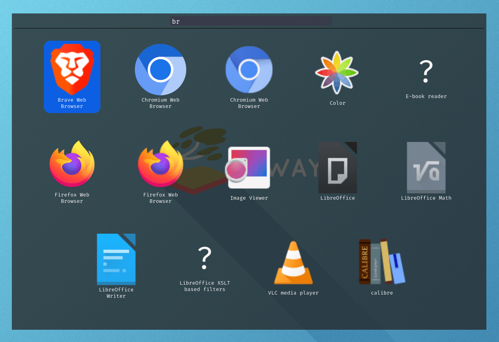
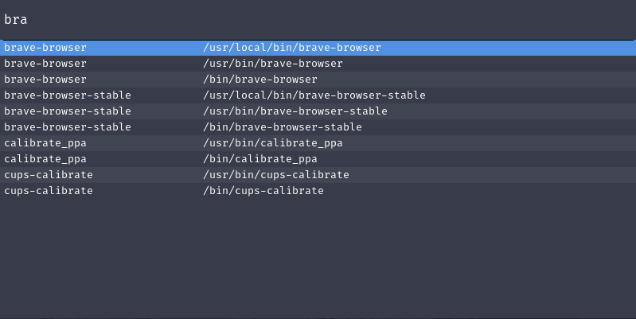

RMenu
------

<!--
 TODO: improve documentation:
  2. explain exchange format and rmenu-build tool
  3. include more examples including fullscreen/transparent app-window
-->

Another customizable Application-Launcher written in Rust

### Features

* Blazingly Fast 🔥
* Simple and Easy to Use
* Customizable (Configuration and CSS-Styling)
* Plugin Support
* Dmenu-Like Stdin Menu Generation

### Installation

```bash
$ make install
```

### Usage

RMenu Comes with Two Builtin Plugins: "Desktop Run" aka `drun`. 

```bash
$ rmenu -r run
```

RMenu also comes with a "$PATH Run" plugin aka `run`. 
Both are managed via the default configuration file after installation.

```bash
$ rmenu -r drun
```

Custom Menus can also be passed much like Dmenu by passing items via
an input. The schema follows a standard as defined in [rmenu-plugin](./rmenu-plugin)

```bash
$ generate-my-menu.sh > input.json
$ rmenu -i input.json
```

When neither a plugin nor an input are specified, rmenu defaults to 
reading from stdin.

```bash
$ generate-my-menu.sh | rmenu
```

### Configuration

Customize RMenu Behavior and Appearal in a [single config](./rmenu/public/config.yaml)

Customize the entire app's appearance with CSS. A few [Example Themes](./themes/) 
are available as reference. To try them out use: `rmenu --css <my-css-theme>`
or move the css file to `$HOME/.config/rmenu/style.css`

### Example Screenshots

#### Launchpad


#### Nord


#### Dark


#### Solarized

